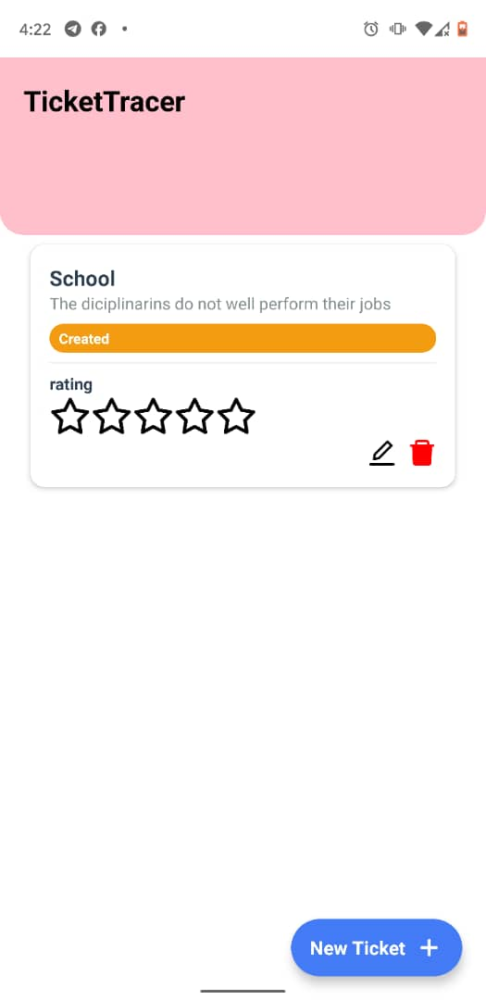
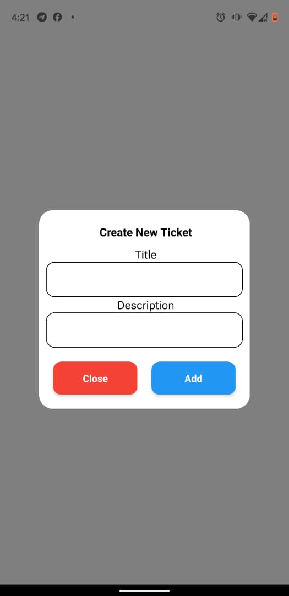
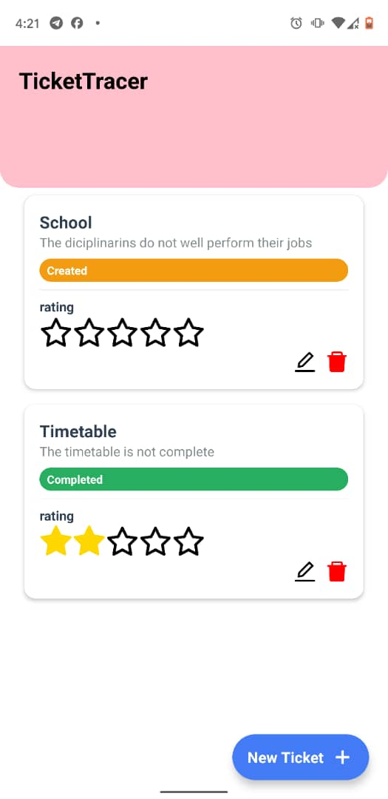

# 🎟️ TicketTracer

A modern **React Native** app built with **Expo**, designed to help you **track, edit, and rate support tickets** easily.
TicketTracer lets you create, update, and manage tickets with status badges, star ratings, and a clean UI.

---

## ✨ Features

- 📝 **Add Tickets** — Quickly create new tickets with title and description.
- 🛠️ **Edit Tickets** — Update ticket details and change their status (Created, Under Assistance, Completed).
- 🚮 **Delete Tickets** — Remove unwanted tickets in one tap.
- ⭐ **Rate Tickets** — Interactive 5-star rating system with smooth feedback.
- 🎨 **Modern UI** — Clean and responsive design using React Native components and icons.
- 💾 **State Management** — Local state handled via React hooks (`useState`).

---

## 🧩 Tech Stack

| Technology | Description |
|-------------|-------------|
| ⚛️ React Native | Core framework for cross-platform mobile development |
| 🚀 Expo | Simplifies development and testing |
| 🧭 TypeScript | Strong typing and cleaner code |
| 🎨 Vector Icons | Icons from `@expo/vector-icons` (Feather, AntDesign, Entypo) |
| 📦 @react-native-picker/picker | For ticket status dropdown |
| 🧱 React Native Safe Area Context | Handles notches and safe areas |

---

## 📸 Screenshots

| Home Screen | Add/Edit Modal | Rating Stars |
|--------------|----------------|---------------|
|  |  |  |

> *(You can replace the image paths with your actual screenshot filenames in an `assets/screenshots/` folder.)*

---

## 🧰 Installation & Setup

### 1️⃣ Clone the repository
```bash
git clone https://github.com/your-username/TicketTracer.git
cd TicketTracer
